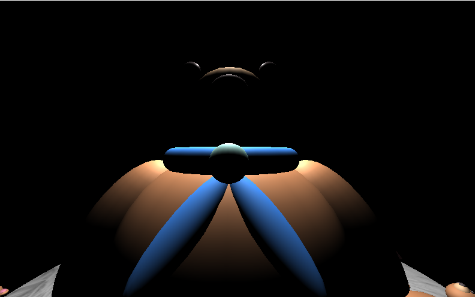

# "Haunted Bear" THREE.js scene

Excerpts from Final project for Wellesley College’s graphics class CS 307, Spring 2019

This is a version of a THREE.js scene I wrote in Spring 2019, with the textures and custom camera removed (these features relied on a private package, although further work would re-implement them with public packages.) The original, textured scene can be imagined with the saved images, and the simplified version can be played by opening `noTexturesDefaultCamera.html` in your browser. *Advance the scene by **slowly** pressing the* `enter` *key.*

The original project contains 1,408 lines of code, including comments, and is mostly JavaScript, with some HTML to load the scene, although the online version is slightly shorter due to the aforementioned removed features.

Further developments could include reimplementing textures and custom camera angles, and adding further details and furniture to the scene.
